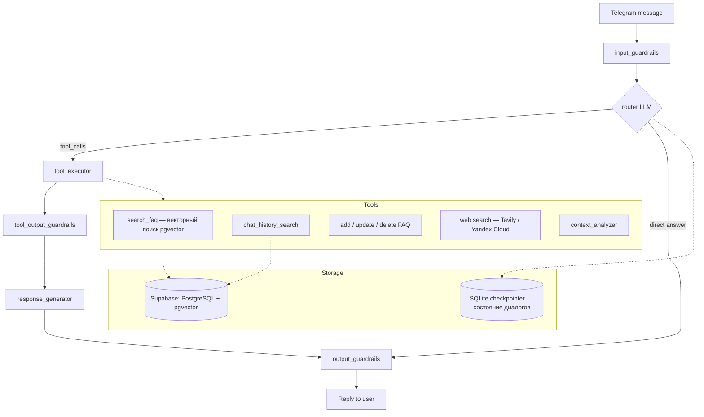

# QA Telegram Bot с LangGraph и Supabase


Это Telegram-бот, предназначенный для ответов на вопросы пользователей, использующий базу знаний (FAQ) и историю чатов. Бот построен с использованием Langchain, LangGraph, SQLAlchemy для взаимодействия с базой данных Supabase (PostgreSQL + pgvector) и Alembic для управления миграциями схемы БД.

## Архитектура агента

Ядро бота — граф LangGraph с guardrails на входе и выходе, LLM-роутером и набором инструментов:



Состояние диалога персистится через `AsyncSqliteSaver` (LangGraph checkpointing), поэтому бот переживает рестарты без потери контекста беседы.

## Стек Технологий

*   **Язык:** Python 3.11+
*   **Telegram API:** `python-telegram-bot`
*   **LLM Оркестрация:** Langchain & LangGraph
*   **LLM:** Используется через API-прокси (например, OpenRouter) - модель настраивается в `.env` и `agent/agent_executor.py`.
*   **База Данных:** Supabase (PostgreSQL)
*   **Векторное хранилище:** `pgvector` (расширение PostgreSQL в Supabase)
*   **ORM:** SQLAlchemy
*   **Миграции БД:** Alembic
*   **Распознавание текста (OCR):** EasyOCR (для обработки изображений)
*   **Контейнеризация:** Docker, Docker Compose
*   **Зависимости:** Управляются через `requirements.txt`

## Основные Возможности

*   **Ответы на вопросы:** Бот отвечает на вопросы в личных сообщениях, при упоминании в группе или при ответе на его сообщение.
*   **Поиск по FAQ:** Использует векторный поиск (эмбеддинги) для нахождения наиболее релевантных ответов в базе знаний FAQ.
*   **Поиск по Истории Чата:** Ищет похожие вопросы в сохраненной истории чата (также с использованием эмбеддингов).
*   **Управление FAQ:** Администраторы могут добавлять, обновлять и удалять записи FAQ через команды бота (требуется реализация/доработка команд или использование инструментов).
*   **Управление Администраторами:** Супер-администраторы (заданные в `.env`) могут управлять списком администраторов бота через команду `/admin`.
*   **Распознавание текста (OCR):** Может извлекать текст из присланных изображений и использовать его для ответа. Эта функция является опциональной.
*   **Анализ Контекста:** Определяет, нужно ли отвечать в группе, на основе упоминаний, ответов и содержания сообщения.
*   **Автоматическая Очистка БД:** Периодически удаляет старые записи из FAQ и истории чатов (настраивается).

## Установка и Запуск

### Локальный Запуск (Рекомендуется для разработки)

1.  **Клонировать репозиторий:**
    ```bash
    git clone <URL репозитория>
    cd QA-bot
    ```
2.  **Создать и активировать виртуальное окружение:**
    ```bash
    python -m venv .venv
    # Windows
    .\.venv\Scripts\activate
    # Linux/macOS
    source .venv/bin/activate
    ```
3.  **Установить зависимости:**
    ```bash
    pip install -r requirements.txt
    ```
    **Примечание по зависимостям для OCR (EasyOCR):**
    Функция распознавания текста из изображений (OCR) требует следующих библиотек:
    *   `easyocr` (~10-15MB)
    *   `torch` (библиотека PyTorch, может занимать от ~200MB до 1GB+ в зависимости от версии и наличия компонентов CUDA)
    *   `torchvision` (дополнение к PyTorch, ~10-50MB)
    *   `torchaudio` (дополнение к PyTorch, ~10-50MB)
    *   `opencv-python-headless` (OpenCV, ~40-60MB)
    *   `Pillow` (уже может быть установлена как зависимость других библиотек)
    *   `numpy` (уже может быть установлена как зависимость других библиотек)
    *   `scipy`
    *   `scikit-image`
    *   `pyclipper`
    *   `shapely`

    Если вам не нужна функция распознавания текста из изображений, вы можете вручную удалить эти зависимости из файла `requirements.txt` перед установкой, чтобы сэкономить место и время установки. В `Dockerfile` эти зависимости включены.

4.  **Настроить переменные окружения:**
    *   Скопируйте `.env.example` в `.env`.
    *   Заполните `.env` вашими данными:
        *   `TELEGRAM_BOT_TOKEN`: Токен вашего Telegram бота.
        *   `TELEGRAM_BOT_USERNAME`: Username бота (без @).
        *   `ADMIN_USER_IDS`: ID супер-администраторов через запятую.
        *   `API_KEY`, `API_BASE`: Ключ и URL для вашего LLM API (например, OpenRouter).
        *   `DB_HOST`, `DB_PORT`, `DB_NAME`, `DB_USER`, `DB_PASSWORD`: Данные для подключения к **пулу транзакций** Supabase (НЕ прямое подключение).
        *   `OPENAI_API_KEY`, `OPENAI_API_BASE`: *Дублируют* `API_KEY`, `API_BASE` для совместимости с некоторыми частями Langchain/OpenAI client. Установите те же значения.
        *   `TEST_DATABASE_URL`: URL для тестовой базы данных (если запускаете тесты).
5.  **Применить миграции базы данных:**
    *   Убедитесь, что расширение `vector` включено в вашей базе Supabase.
    *   Выполните:
        ```bash
        alembic upgrade head
        ```
6.  **Запустить бота:**
    ```bash
    python main.py
    ```

### Запуск с Docker

1.  **Убедитесь, что Docker и Docker Compose установлены.**
2.  **Настройте файл `.env`** (см. шаг 4 в локальном запуске). Docker Compose автоматически подхватит этот файл.
3.  **Собрать и запустить контейнеры:**
    ```bash
    docker-compose up --build -d
    ```
    *   `-d` запускает контейнеры в фоновом режиме.
    *   `--build` пересобирает образ, если были изменения в `Dockerfile` или коде.
4.  **Просмотр логов:**
    ```bash
    docker-compose logs -f qa-bot
    ```
5.  **Остановка:**
    ```bash
    docker-compose down
    ```

## Управление Миграциями Базы Данных (Alembic)

Alembic используется для управления изменениями схемы базы данных.

*   **Создание новой миграции (после изменения моделей в `database/models.py`):**
    ```bash
    alembic revision --autogenerate -m "Краткое описание изменений"
    ```
    *   *Важно:* Проверьте сгенерированный файл миграции в `alembic/versions/` перед применением. Автогенерация не всегда идеальна.
*   **Применение последней миграции:**
    ```bash
    alembic upgrade head
    ```
*   **Откат последней миграции:**
    ```bash
    alembic downgrade -1
    ```
*   **Проверка текущего состояния:**
    ```bash
    alembic current
    ```
*   **Проверка расхождений между моделями и БД:**
    ```bash
    alembic check
    ```

## Структура Проекта

*   `agent/`: Логика LangGraph агента, состояние, инструменты, промпты.
*   `database/`: Модели SQLAlchemy, CRUD операции, подключение к БД, управление эмбеддингами.
*   `telegram_interface/` (неявный, логика в `main.py`): Обработчики Telegram.
*   `core/`: Общие утилиты (если появятся).
*   `tests/`: Юнит-тесты.
*   `alembic/`: Файлы конфигурации и версий миграций Alembic.
*   `logs/`: Файлы логов бота.
*   `main.py`: Точка входа приложения, инициализация Telegram бота и агента.
*   `Dockerfile`, `docker-compose.yml`: Файлы для контейнеризации.
*   `requirements.txt`: Зависимости Python.
*   `.env`: Переменные окружения (секреты) - **не коммитить в Git!**
*   `.env.example`: Пример файла `.env`.
*   `alembic.ini`: Конфигурация Alembic.
*   `README.md`: Этот файл.

## Заметки

*   Проект прошел рефакторинг, удалены зависимости FastAPI/Gunicorn, настроено подключение к БД через пул транзакций Supabase.
*   Управление схемой БД теперь полностью осуществляется через Alembic. НЕ вносите изменения в структуру таблиц напрямую через интерфейс Supabase, используйте миграции. 